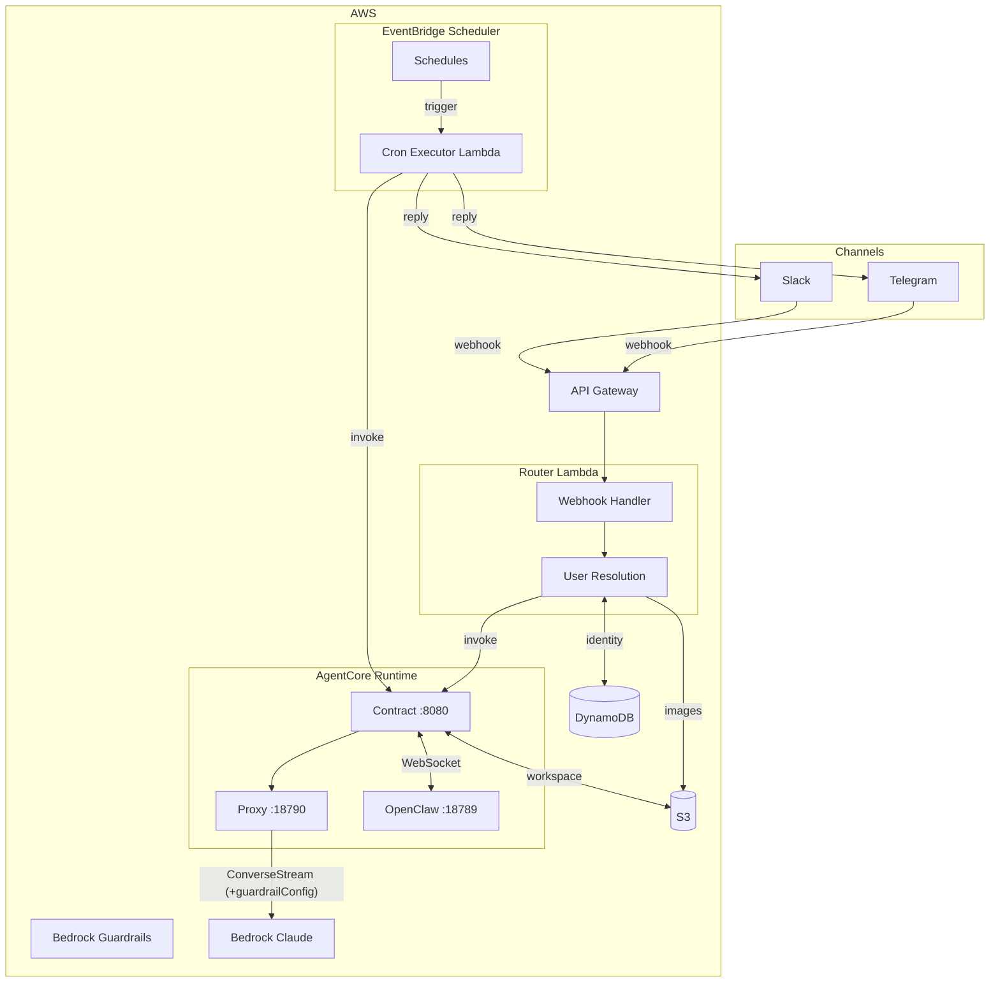
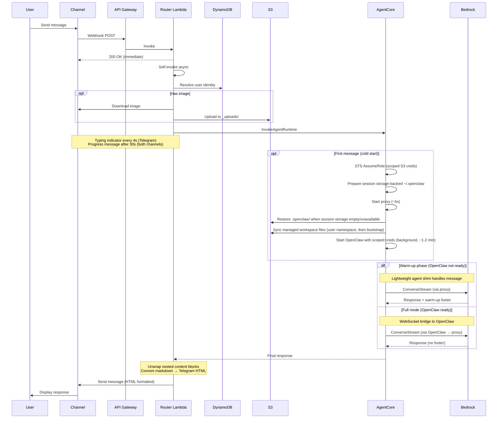
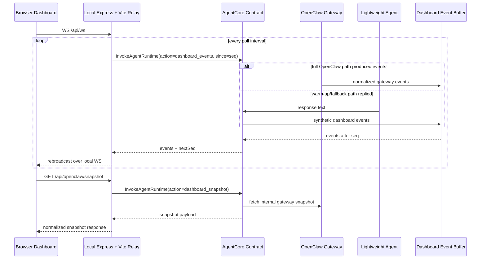
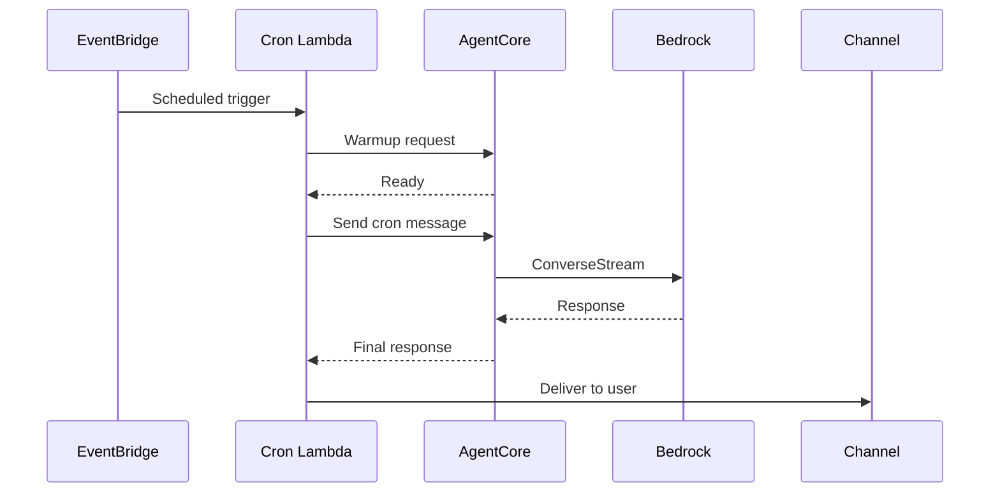
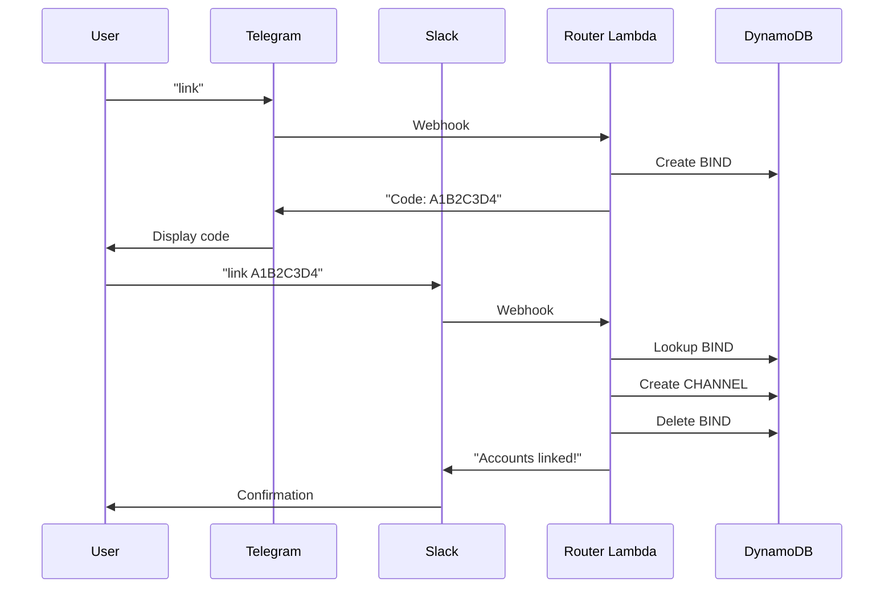
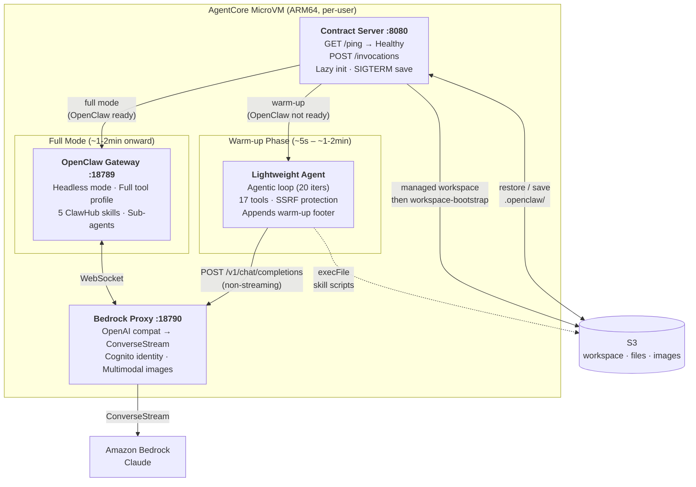
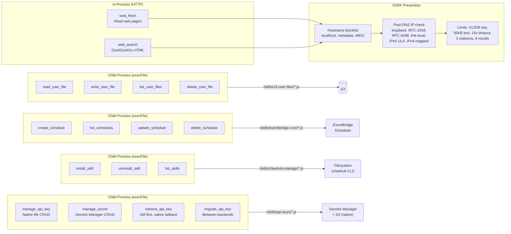

# Detailed Technical Architecture

This document provides a detailed technical view of the OpenClaw on AgentCore architecture. For a high-level overview, see the [README](../README.md#architecture).

## Component Diagram



## Component Details

| Component | Port | Purpose |
|---|---|---|
| **Contract Server** | 8080 | AgentCore HTTP contract (`/ping`, `/invocations`), lazy initialization, routing (shim vs WebSocket bridge) |
| **Lightweight Agent** | — | Warm-up shim during cold start; agentic loop with 13 tools via proxy → Bedrock (see below) |
| **Bedrock Proxy** | 18790 | OpenAI-compatible API → Bedrock ConverseStream, Cognito identity, multimodal image handling |
| **OpenClaw Gateway** | 18789 | Headless AI agent with full tools and ClawHub skills (available after ~1-2 min startup) |

## Data Flow

### Message Flow (User → Agent → Response)



### Dashboard Relay Flow (Browser → Local Relay → AgentCore)

This path exists because the internal OpenClaw gateway WebSocket is only reachable inside the AgentCore runtime session. The browser cannot connect to it directly, so the dashboard uses a local relay plus runtime-side buffering.



**Notes:**

- `dashboard_events` is backed by an **in-memory** buffer inside the runtime session, so it resets on session restart/redeploy.
- The dashboard must be pinned to the same **actorId / userId / runtimeSessionId** as the Telegram user whose conversation it wants to mirror.
- Synthetic events are required because the lightweight warm-up/fallback path can reply before the full OpenClaw gateway emits normal chat events.
- The current dashboard frontend still derives `working` / `idle` from `dashboard_snapshot` polling. The WS relay mainly carries message events, plus relay-added status hints for future/live consumers.

### Cron Job Flow (Scheduled Task)



### Cross-Channel Account Linking



## Container Internals



### Lightweight Agent Tools



### Two-Phase Startup

```mermaid
gantt
    title Cold Start Timeline
    dateFormat s
    axisFormat %S s

    section Container
    MicroVM created                     :done, t0, 0, 1s

    section Warm-up Phase
    Proxy starts (~5s)                  :active, t1, 1s, 5s
    Lightweight agent handles messages  :active, t2, 5s, 90s

    section Background
    OpenClaw starting (~1-2 min)        :crit, t3, 5s, 90s
    Workspace restore from S3           :done, t4, 1s, 10s
    Managed workspace sync from S3      :done, t5, 2s, 8s

    section Full Mode
    OpenClaw ready — handoff            :milestone, m1, 90s, 0
    Full runtime handles messages       :t6, 90s, 140s
```

**Warm-up phase** (t=~5s to ~1-2min): Lightweight agent responds with 17 tools (web_fetch, web_search, 4 file, 4 cron, 3 skill management, 4 API key tools). All responses include `"_Warm-up mode — after full startup..._"` footer.

**Full mode** (t=~1-2min onward): OpenClaw gateway handles messages via WebSocket bridge. No warm-up footer. ClawHub skills available (transcript, deep-research-pro, jina-reader, telegram-compose, task-decomposer).

### Lightweight Agent Architecture

The lightweight agent (`bridge/lightweight-agent.js`) provides immediate responsiveness during the ~1-2 minute OpenClaw cold start. It is NOT a replacement for OpenClaw — it's a shim that handles messages until the full runtime is ready.

| Property | Detail |
|---|---|
| **Routing** | Calls proxy at `127.0.0.1:18790/v1/chat/completions` (OpenAI format, non-streaming) |
| **Agentic loop** | Up to 20 iterations of tool-call → tool-result → assistant-response |
| **Tools (17)** | `read_user_file`, `write_user_file`, `list_user_files`, `delete_user_file`, `create_schedule`, `list_schedules`, `update_schedule`, `delete_schedule`, `install_skill`, `uninstall_skill`, `list_skills`, `manage_api_key` (native file), `manage_secret` (Secrets Manager), `retrieve_api_key` (unified lookup), `migrate_api_key` (between backends), `web_fetch`, `web_search` |
| **File/cron tools** | Execute skill scripts via `execFile` with isolated env vars |
| **Web tools** | In-process HTTP(S) with SSRF prevention (blocked IPs, DNS rebinding mitigation, redirect validation) |
| **SSRF protection** | Pre-connection hostname blocklist + post-DNS-resolution IP validation covering loopback, RFC-1918, RFC-6598, link-local (AWS IMDS), IPv6 ULA, IPv4-mapped IPv6 |
| **Web limits** | 512KB raw HTML, 50KB text output, 15s timeout, 3 redirect max, 8 search results |
| **Detection** | Appends deterministic `"_Warm-up mode — ..."` footer to every response; absence of footer = OpenClaw is handling messages |
| **Handoff** | Contract server checks `openclawReady` flag; once true, all messages route via WebSocket bridge to OpenClaw |

## S3 Bucket Structure

```
s3://openclaw-user-files-{account}-{region}/
├── telegram_123456789/           # User namespace (channel_id)
│   ├── .openclaw/                 # Workspace (synced on init/shutdown)
│   │   ├── openclaw.json
│   │   ├── MEMORY.md
│   │   ├── USER.md
│   │   └── ...
│   ├── _uploads/                  # Image uploads (from Router Lambda)
│   │   ├── img_1709012345_a1b2.jpeg
│   │   └── ...
│   └── documents/                 # User files (via s3-user-files skill)
│       └── notes.md
├── slack_U12345678/
│   └── ...
└── ...
```

## DynamoDB Schema

**Table: `openclaw-identity-dev`** (example with `OPENCLAW_ENV_SUFFIX=dev`)

| PK | SK | Purpose | TTL |
|---|---|---|---|
| `CHANNEL#telegram:123` | `PROFILE` | Channel → userId mapping | - |
| `USER#user_abc` | `PROFILE` | User profile | - |
| `USER#user_abc` | `CHANNEL#telegram:123` | User's bound channels | - |
| `USER#user_abc` | `SESSION` | Current AgentCore session ID | - |
| `USER#user_abc` | `CRON#reminder-1` | Cron schedule metadata | - |
| `BIND#ABC123` | `BIND` | Cross-channel bind code | 10 min |
| `ALLOW#telegram:123` | `ALLOW` | User allowlist entry | - |

## Security Architecture

See [security.md](security.md) for the complete security architecture.

**Key controls:**
- VPC isolation with 7 VPC endpoints
- Webhook signature validation (Telegram + Slack)
- Per-user microVM isolation
- STS session-scoped credentials (per-user S3 namespace + DynamoDB record restriction)
- KMS encryption at rest
- Security group egress restricted to HTTPS (TCP 443) only
- OpenClaw `read` tool denied (prevents credential access); `exec` allowed for skill management (STS-scoped); proxy bound to loopback
- Least-privilege IAM with cdk-nag enforcement
