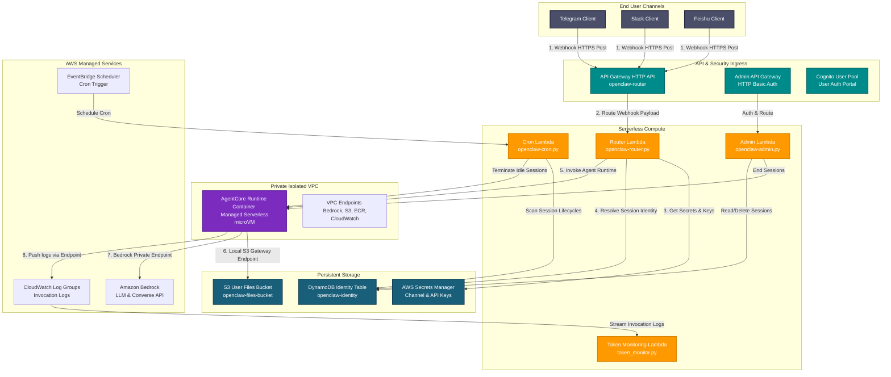
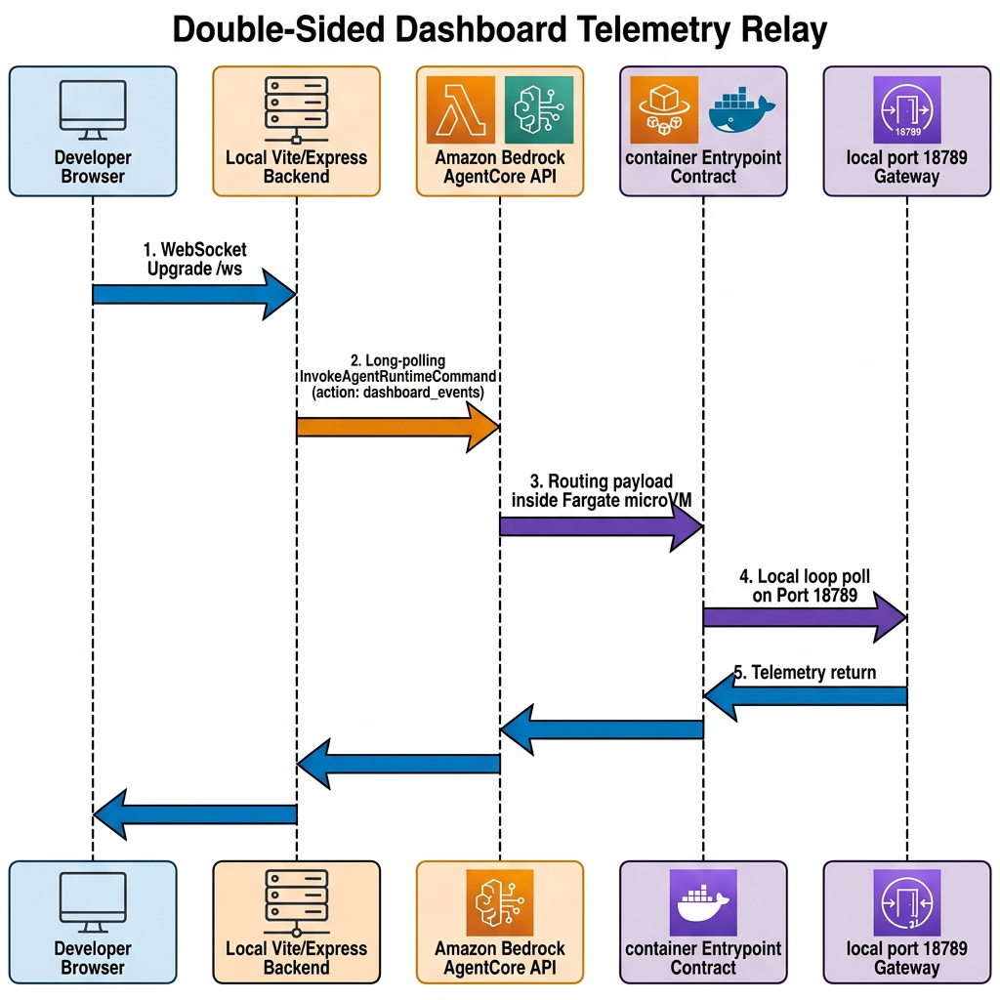
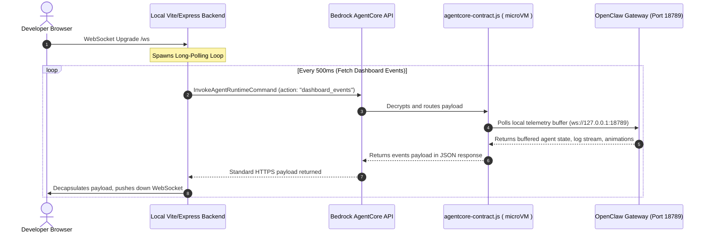
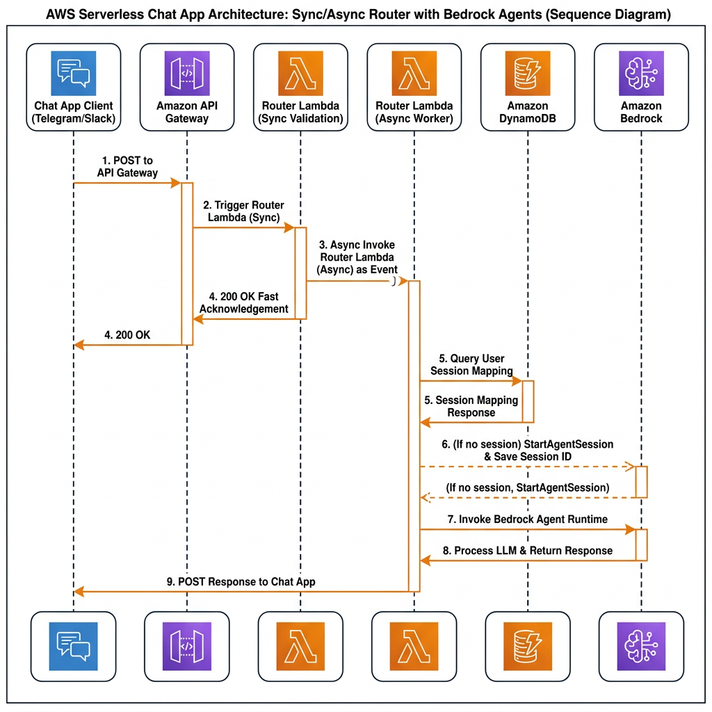
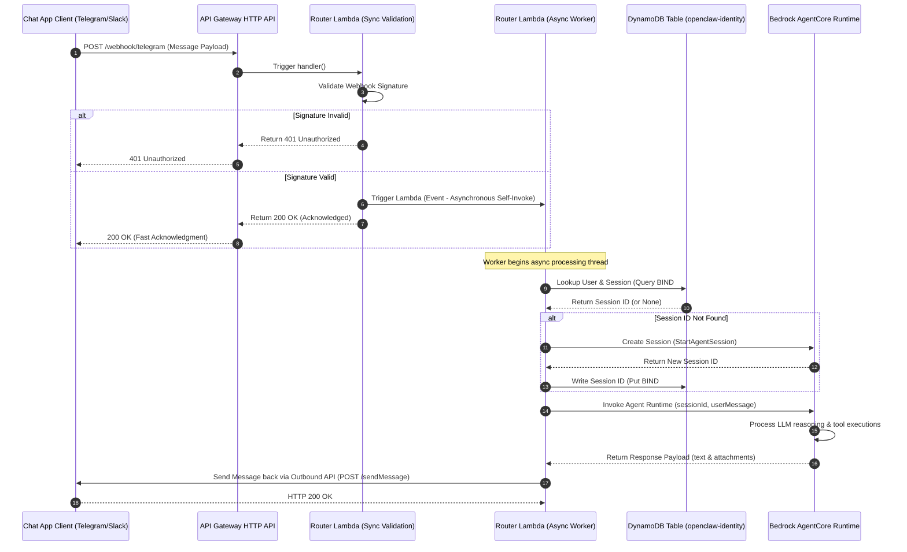

# Architecture Blog: Building an Omnichannel, Multi-Agent Embodied AI Platform with Amazon Bedrock AgentCore and OpenClaw


**Published on:** June 17, 2026  
**Authors:** Senior Cloud Architect, AI/ML Specialist  
**Category:** Artificial Intelligence, Serverless, Robotics, Architecture  
**Description:** Discover how to coordinate specialized digital and humanoid robot subagents across Telegram, Slack, and web dashboards using OpenClaw on serverless Amazon Bedrock AgentCore. We present five key architecture patterns, including developer VPC cost-optimizations, a double-sided WebSocket telemetry relay for isolated AgentCore microVMs, DynamoDB-backed omnichannel session persistence, and zero-trust identity scanning for automated Cognito multi-tenancy.

---

Modern enterprise operations are undergoing a paradigm shift from stateless chatbots to stateful, autonomous AI agents. These next-generation agents must interact with physical systems (embodied robotics) and digital applications (browser automation) while offering a unified interface across web dashboards and chat platforms (Telegram, Slack). 

To coordinate these capabilities without managing permanent, high-cost server fleets, we built **OpenClaw on Amazon Bedrock AgentCore**. This architecture leverages Amazon Bedrock AgentCore—which runs stateful container sessions inside fully isolated, serverless microVMs—and integrates it with the OpenClaw multi-agent framework.

In this post, we discuss the architectural evolution and five critical engineering solutions we implemented to make this platform cost-effective, multi-tenant, and capable of coordinating both physical humanoid robots and digital browser-driven automation.

---

## High-Level Architecture Overview

The system architecture spans a serverless frontend (React + Phaser), an omnichannel entrypoint router (AWS Lambda), stateful sessions running in Amazon Bedrock AgentCore, and a zero-trust proxy layer securing communication with foundation models and cloud storage.


<details>
<summary><b>Click to expand raw Mermaid Source Code</b></summary>



</details>

---

## 1. Drastically Lowering Friction: Cost-Optimized Dev vs. Isolated Prod Environments

The default production reference architecture for Amazon Bedrock AgentCore is designed for high-isolation enterprise environments. To achieve absolute security, AWS places AgentCore sessions inside private subnets of a Virtual Private Cloud (VPC), routing all AWS service traffic through **VPC Interface Endpoints** (such as ECR, Bedrock Runtime, CloudWatch, Secrets Manager, and SSM). 

However, VPC Interface Endpoints carry a flat cost of **$0.045 per hour per endpoint**, plus NAT Gateway hourly charges and data transfer rates. For six required services in a multi-AZ deployment, this security architecture costs **hundreds of dollars per month** even when the system is completely idle. 

To lower developer friction and enable cost-free local testing, we split our infrastructure into two distinct environments via the AWS Cloud Development Kit (AWS CDK) in `stacks/vpc_stack.py` and `stacks/agentcore_stack.py`:

| Architectural Component | Production (Prod) Environment | Developer (Dev) Environment |
| :--- | :--- | :--- |
| **VPC Configuration** | Multi-AZ with Public and Private Subnets | Public Subnet Only (Custom NAT Gateways = 0) |
| **Outbound Routing** | NAT Gateway (Private Subnet egress) | Direct Public Internet Route |
| **Service Integration** | 7 Private VPC Endpoints (SSM, SecretsManager, ECR, Bedrock Runtime, Logs, Monitoring) | No VPC Endpoints (Outbound connections route over Public Internet) |
| **AgentCore Network Mode** | `RuntimeNetworkConfiguration.using_vpc()` | `RuntimeNetworkConfiguration.using_public_network()` |
| **Browser Resource Mode** | `CfnBrowserCustom` with `"network_mode": "VPC"` | `CfnBrowserCustom` with `"network_mode": "PUBLIC"` |
| **Network Security** | Enterprise Network Isolation (Private Security Groups) | IAM-Scoped Resource Policies and IAM Authorization |

### CDK Implementation Detail

In `stacks/vpc_stack.py`, we check the environment suffix. If the suffix matches `dev`, we bypass endpoint creation and configure the VPC to have zero NAT gateways:

```python
is_dev = suffix == "dev"

vpc_kwargs = {
    "ip_addresses": ec2.IpAddresses.cidr("10.0.0.0/16"),
    "nat_gateways": 0 if is_dev else 1,
    "subnet_configuration": [
        ec2.SubnetConfiguration(
            name="Public",
            subnet_type=ec2.SubnetType.PUBLIC,
            cidr_mask=24,
        ),
    ],
}
```

In `stacks/agentcore_stack.py`, the AgentCore session utilizes AgentCore's built-in public network configuration when running in development mode, allowing the microVM direct outbound access secured solely by IAM credentials:

```python
runtime_network_config = agentcore.RuntimeNetworkConfiguration.using_public_network()
if not is_dev:
    runtime_network_config = agentcore.RuntimeNetworkConfiguration.using_vpc(
        self,
        vpc=vpc,
        security_groups=[self.agent_sg],
        vpc_subnets=ec2.SubnetSelection(subnets=private_subnets),
    )
```

This hybrid model allows developers to prototype, debug, and iterate in a **near-zero-idle-cost sandbox**, while preserving a simple deployment flag to promote the exact same code to a high-isolation, compliance-ready enterprise VPC.

---

## 2. Bridging Isolated MicroVMs: The Double-Sided Telemetry Relay

We integrated a rich React + Phaser web dashboard (`openclaw-character-dashboard`) to render real-time robot statuses, agent thinking paths, and digital human avatar animations. However, Bedrock AgentCore's serverless microVMs are isolated; they cannot expose arbitrary open TCP ports (like the local OpenClaw gateway running on port `18789`) to the public internet for a direct browser WebSocket (`ws://`) connection.

To bypass this isolation without opening public inbound network ports, we designed a **Double-Sided Telemetry Relay**:



<details>
<summary><b>Click to expand raw Mermaid Source Code</b></summary>



</details>


### The Container Contract Handler

In `bridge/agentcore-contract.js`, the entrypoint intercepts the invocation. When the client invokes `dashboard_events`, the container reads from the internal loop buffer of the OpenClaw gateway and flushes the events to the AWS response payload:

```javascript
if (action === "dashboard_events") {
  lastActivityTime = Math.floor(Date.now() / 1000);
  const { userId, actorId, channel } = payload;
  const ready = await ensureDashboardReady({ userId, actorId, channel });
  if (!ready.ok) {
    res.writeHead(200, { "Content-Type": "application/json" });
    res.end(JSON.stringify({ status: ready.status, error: ready.error }));
    return;
  }

  const since = Number(payload.since || 0);
  const limit = Number(payload.limit || 100);
  const eventPayload = getDashboardEventsSince(since, limit);
  
  res.writeHead(200, { "Content-Type": "application/json" });
  res.end(JSON.stringify({
    status: "ready",
    ...eventPayload,
    userId: currentUserId,
    sessionId: payload.sessionId || null,
  }));
  return;
}
```

### The Vite/Express Client Handshake

On the local side, inside the dashboard directory `/home/developer/Documents/data-disk/openclaw-character-dashboard/server/index.ts`, the Express backend translates browser requests into AWS SDK `InvokeAgentRuntimeCommand` calls:

```typescript
async function fetchAgentCoreEvents(
  config: AgentCoreGatewayConfig,
  since: number,
): Promise<{
  events?: Record<string, unknown>[];
  nextSeq?: number;
  streamStatus?: Record<string, unknown>;
}> {
  const payload = (await invokeAgentCoreAction(config, {
    action: "dashboard_events",
    userId: config.userId,
    actorId: config.actorId,
    channel: config.channel,
    sessionId: config.runtimeSessionId,
    since,
    limit: 100,
  })) as any;

  if (payload.status !== "ready") {
    throw new Error(payload.error ?? `AgentCore dashboard events failed with status ${payload.status}`);
  }
  return payload;
}
```

This mechanism bridges the browser dashboard to the deep-tech microVM container seamlessly, maintaining high-velocity event streaming over safe, standard IAM-authenticated AWS API requests.

---

## 3. Embodied AI: Multi-Agent Choreography for Robots and Digital Humans

OpenClaw is a multi-agent orchestration framework. To interact with the physical and digital worlds, the primary agent does not try to handle every action directly. Instead, it delegates to specialized agents:

1. **Embodied Robotics**: Robot subagents (`robot_1` through `robot_6`) represent specialized robot brains. 
2. **Digital Human**: Headless browsing capability allows the agent to navigate the web, research topics, and interact with digital portals.

### Embodied Robot Brains
Each robot subagent (such as `robot_1`, named 雲) is configured with an independent persona, memory stack, and tool profile defined in `bootstrap/managed-workspace/agents/robot_1/IDENTITY.md`:

```markdown
- **Name:** robot_1 or 雲
- **Robot ID:** `robot_1`
- **Type:** Humanoid
- **Role:** Cloud Architect & Strategy
- **Persona:** Visionary, scalable, and focused on high-level design.
```

When a user requests physical coordination (e.g., "Ask robot_1 to check the server rack and wave when done"), the main agent leverages OpenClaw's specialist delegation to spawn a subagent execution loop. The subagent uses the `humanoid` Model Model Context Protocol (MCP) skill to execute physical operations:

- **humanoid.stand()**: Stabilizes the humanoid mechanical platform.
- **humanoid.observe()**: Captures visual camera feeds for computer vision processing.
- **humanoid.wave()**: Triggers high-precision actuator movements.
- **humanoid.speak("message")**: Translates text into speech output.

### Headless Web Browsing via CfnBrowserCustom
For digital interaction, we deploy Bedrock AgentCore's custom headless Chromium resource (`CfnBrowserCustom`). 
- In development, the browser utilizes a public network mode (`"network_mode": "PUBLIC"`) to browse pages.
- In production, it routes inside our VPC (`"network_mode": "VPC"`), ensuring that all research and scraping traffic routes through secure company proxies, preventing IP leaks and securing internal enterprise portal access.

---

## 4. Seamless Omnichannel Continuity: DynamoDB-Backed Stable Session Mapping

Omnichannel continuity is highly difficult to implement when linking stateless webhook interfaces (such as Telegram webhooks) with stateful web dashboards. If a user is chatting with an agent on Telegram, they expect to open their web dashboard and see the exact same active agent session, complete with current thought sequences and subagent statuses.

To solve this, we implemented a DynamoDB-backed router in Python (`lambda/router/index.py`) that acts as an identity boundary.



<details>
<summary><b>Click to expand raw Mermaid Source Code</b></summary>



</details>

### The 33-Character Session ID Constraint

Amazon Bedrock AgentCore enforces a strict constraint: **`runtimeSessionId` must be at least 33 characters long**. Standard short integer IDs or plain names will cause immediate API validation errors.

In `lambda/router/index.py`, we implement a robust session mapping function (`get_or_create_session`) that queries the `identity_table` and guarantees compliance with the character limit:

```python
def get_or_create_session(user_id):
    """Get or create a session ID for the user. Session IDs must be >= 33 chars."""
    pk = f"USER#{user_id}"

    try:
        resp = identity_table.get_item(Key={"PK": pk, "SK": "SESSION"})
        if "Item" in resp:
            # Update last activity
            identity_table.update_item(
                Key={"PK": pk, "SK": "SESSION"},
                UpdateExpression="SET lastActivity = :now",
                ExpressionAttributeValues={":now": time.strftime("%Y-%m-%dT%H:%M:%SZ", time.gmtime())},
            )
            return resp["Item"]["sessionId"]
    except ClientError as e:
        logger.error("DynamoDB session lookup failed: %s", e)

    # Create new session (>= 33 chars required by AgentCore)
    session_id = f"ses_{user_id}_{uuid.uuid4().hex[:12]}"
    if len(session_id) < 33:
        session_id += "_" + uuid.uuid4().hex[: 33 - len(session_id)]
    
    # Store session in DynamoDB...
    return session_id
```

By resolving Telegram usernames, Slack user IDs, and web authentication codes into a stable DynamoDB `user_id`, we fetch the exact same, long-lived `runtimeSessionId` across all platforms. A chat message sent on Telegram triggers an `InvokeAgentRuntime` command under session ID `ses_user_123_abc...`. When the dashboard long-polls the gateway with the same session key, it retrieves the execution log in real time!

---

## 5. Dynamic Zero-Trust Isolation: On-the-Fly Identity Prefix Extraction

To prevent cross-tenant context leaks, we cannot trust AgentCore container session files to be completely public or shared. Each user must have their own isolated secure storage namespace on S3 for uploading files, retrieving logs, and persisting daily memories.

Because the underlying LLM Converse API doesn't natively carry authentication context, we intercept all calls to Amazon Bedrock inside the AgentCore session container via a local proxy, `bridge/agentcore-proxy.js`.

### Reverse Prompt Scanning
Rather than keeping high-overhead databases inside the container, the proxy scans the incoming prompt history **in reverse-chronological order** (from the most recent message backward). This prevents cross-channel identity leakage (e.g., if another user's display name appears in historical logs, we ignore it and only look at the most recent context).

The proxy extracts user identity based on three distinct message "envelope" formats:

1. **Format C (Untrusted JSON Metadata Block - Highest Priority)**:
   ```json
   Conversation info (untrusted metadata):
   ```json
   { "message_id": "542", "sender": "123456789", "channel": "telegram" }
   ```
   ```
2. **Format A (Fallback Display Name)**:
   `System: [TIMESTAMP] Slack DM from JohnDoe: message`
3. **Format B (Legacy Prefix)**:
   `[Telegram JohnDoe id:12345 timestamp] message`

```javascript
// Scan messages in REVERSE to catch the active user prompt first
for (let i = parsed.messages.length - 1; i >= 0; i--) {
  const msg = parsed.messages[i];
  if (msg.role !== "user") continue;
  const text = getTextContent(msg.content);
  if (!text) continue;

  // Format C check:
  const formatC = text.match(/Conversation info \(untrusted metadata\):\s*```json\s*(\{[\s\S]*?\})\s*```/);
  if (formatC) {
    const meta = JSON.parse(formatC[1]);
    if (meta.sender) {
      actorId = `${meta.channel || "telegram"}:${meta.sender}`;
      break;
    }
  }
}
```

### On-the-Fly Cognito and Scoped STS Generation

Once `actorId` and `channel` are recovered:
1. **Dynamic Provisioning**: The proxy automatically calls Cognito User Pools (`ensureCognitoUser`) to provision a user account dynamically if it is the user's first time interacting with the agent.
2. **STS Policy Restrictions**: The proxy performs an authentication handshake to retrieve a Cognito JWT token, then invokes AWS STS to assume an IAM role. The role's policy is dynamically scoped using a restricted resource suffix:

```json
{
  "Version": "2012-10-17",
  "Statement": [
    {
      "Effect": "Allow",
      "Action": ["s3:GetObject", "s3:PutObject", "s3:DeleteObject"],
      "Resource": "arn:aws:s3:::openclaw-user-files/telegram:123456789/*"
    }
  ]
}
```

This is true **Zero-Trust Multi-Tenancy**. Even if a prompt injection attack attempts to make the agent read files from other tenants, the actual AWS credentials bound to that session's execution sub-thread physically lack permissions to read S3 prefixes outside the user's explicit folder namespace.

---

## Conclusion: Orchestrating the Future of Stateful Agents

By marrying **Amazon Bedrock AgentCore** and **OpenClaw**, we successfully built an enterprise-ready, cost-optimized agent orchestration platform. 

By utilizing public network modes for dev sandboxes, building a double-sided telemetry relay for WebSocket streaming, automating subagent physical/digital delegation, securing omnichannel sessions in DynamoDB, and enforcing on-the-fly zero-trust identity policies, we proved that stateful AI systems can be robust, cost-effective, and safe.

The code and infrastructure stacks are fully open-source and modular. You can start deploying your cost-optimized Developer stack today and begin choreographing your own fleet of digital humans and humanoid robots!

---

### Have questions?
Let us know in the comments below, or check out our architectural guide inside the project repository!
