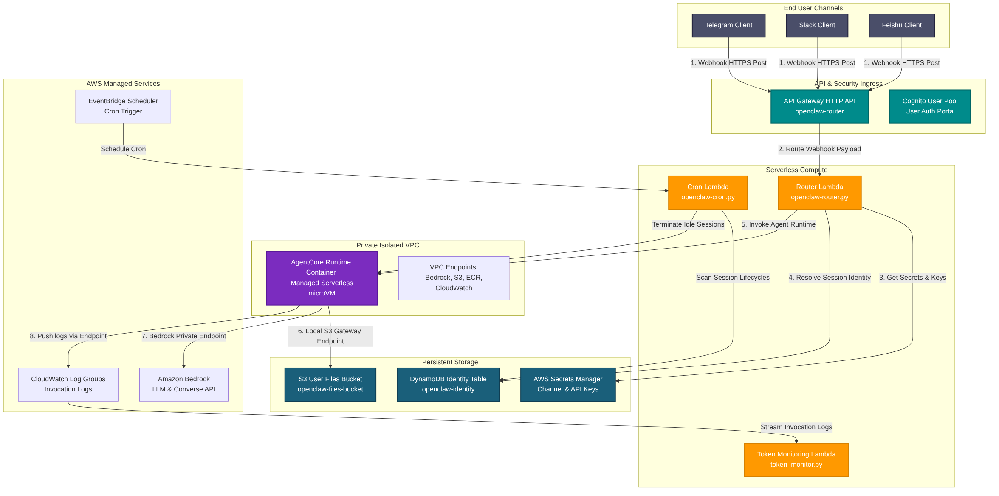
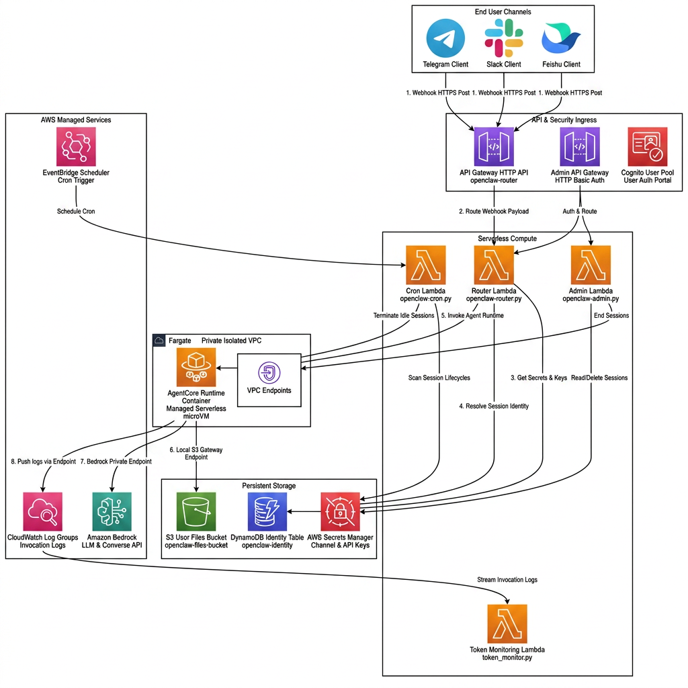
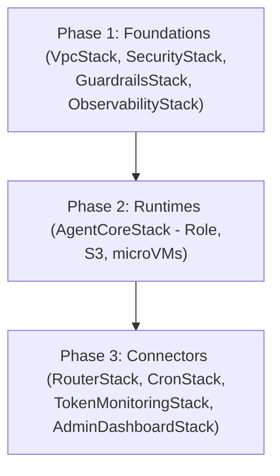

# OpenClaw on Amazon Bedrock AgentCore: System Design Overview

## Technical Architecture Diagrams

### Standard System Topology

### AWS-Style Enterprise Blueprint

This document presents the comprehensive system architecture design for deploying OpenClaw on AWS utilizing the **Amazon Bedrock AgentCore Runtime**. 

The system implements a serverless, per-user microVM session architecture designed to ingest messages from external chat platforms (Telegram, Slack, Feishu) via a high-performance webhook Router, route them into a secure private VPC network, and leverage Amazon Bedrock Large Language Models (LLM) for processing.

---

## 1. Core Architectural Pillars

The solution architecture is structured around five primary technical pillars:

1. **State-of-the-Art Private VPC Ingress**:
   Maintains all Bedrock AgentCore runtime serverless microVMs inside highly secure, private subnets. Traffic exits to AWS managed services (Bedrock, S3, Secrets Manager, CloudWatch) exclusively through private Interface and S3 Gateway VPC Endpoints, ensuring zero exposure to the public internet.

2. **Asynchronous Webhook Ingest Router**:
   Employs an AWS API Gateway HTTP API and a Router Lambda function to handle chat webhooks. By utilizing signature verification and immediate async self-invocation, the system acknowledges webhooks in under 100ms, completely avoiding chat platform retries and request timeouts.

3. **Per-User Isolated Runtime Sessions**:
   Creates an isolated, containerized Bedrock AgentCore session per user. This guarantees that user files, chat histories, tools, and browser sessions are fully sandboxed from other users.

4. **Deterministic Token & Usage Monitoring**:
   Taps into the Bedrock AgentCore invocation logging stream in Amazon CloudWatch. A lightweight Token Monitoring Lambda analyzes model token consumption in near real-time, sending automated notifications via Amazon SNS if anomalous spikes or quota breaches are detected.

5. **Serverless Cost-Efficiency & Automated Lifecycles**:
   Utilizes Amazon EventBridge Scheduler and a Cron Lambda function to monitor session lifecycles. Sessions idle-terminate naturally; the cron periodically scans session states and tears down idle microVMs, achieving absolute zero-cost idling.

---

## 2. Solution Deployment Phases

As defined in `app.py`, the CDK application deploys the solution deterministically across three main logical phases:

- **Phase 1 (Foundations)**: Deploys the isolated VPC, KMS Customer Managed Keys, Secrets Manager targets, Cognito User/Identity Pools, Amazon Bedrock Guardrails, and CloudWatch log groups.
- **Phase 2 (Runtimes)**: Instantiates the Bedrock AgentCore runtime execution IAM Roles, Security Groups, S3 User Files Buckets, and private VPC Endpoints.
- **Phase 3 (Connectors)**: Deploys the public HTTP API Gateway, Router Lambda, EventBridge scheduler, Cron Lambda, Token Monitoring analyzer, and Admin Dashboard.
