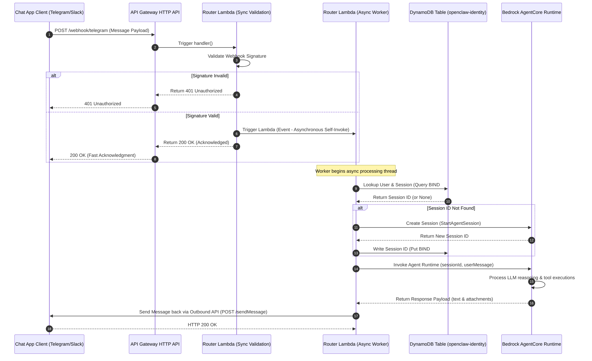

# Webhook Ingest Router Design Specification

## Architectural Sequence Diagrams

### Standard Sequence Flowchart

### AWS-Style Enterprise Blueprint

This document details the architectural specifications of the **`RouterStack`** and its asynchronous webhook ingestion model. This component acts as the public ingress boundary for external chat applications, providing secure, fast-response message processing.

---

## 1. Split-Execution Webhook Ingestion Model

Incoming messages from messaging platforms (Telegram, Slack, Feishu) expect an immediate HTTP status response. If processing takes more than a few seconds (e.g., waiting for an LLM to reason and generate a response), the platform will timeout and retry the POST request, leading to duplicate execution spikes and high platform overhead.

To solve this, the **openclaw-router** employs a split synchronous-asynchronous execution model:

1. **Synchronous Validation (Fast Return)**:
   - The user's platform sends a POST request containing the chat webhook payload.
   - API Gateway routes the payload directly to the **Router Lambda** synchronously.
   - The Router Lambda instantly validates the platform's cryptographic webhook signature.
   - Upon successful verification, the Lambda launches a copy of itself asynchronously using an **Event-type Invoke** and immediately returns an HTTP `200 OK` response to API Gateway.
   - The entire synchronous path completes in **under 100 milliseconds**, guaranteeing that the messaging platform is satisfied.

2. **Asynchronous Processing (Worker Thread)**:
   - The asynchronously invoked Router Lambda instance is triggered and begins the heavy-duty execution loop.
   - It performs user identity mapping, resolves or provisions the user's isolated AgentCore session, and routes the message payload into the Bedrock AgentCore private runtime container inside the VPC.

---

## 2. Platform Signature Verification

Security is enforced at the entry point of the Router Lambda. Before starting any asynchronous execution, the Lambda verifies that the request originates from an authentic messaging platform:

- **Telegram**: Checks the incoming `X-Telegram-Bot-Api-Secret-Token` header against the secure token stored inside AWS Secrets Manager.
- **Slack**: Computes an HMAC-SHA256 signature using the request's raw body, timestamp (`X-Slack-Request-Timestamp`), and the Slack Signing Secret, then matches it with the `X-Slack-Signature` header.
- **Feishu / Lark**: Validates the request signature using custom Lark security signing handshakes.

---

## 3. Session Isolation & Identity Mappings

The DynamoDB Identity Table (`openclaw-identity`) maps messaging platform users to unique Bedrock AgentCore sessions using a single-table NoSQL structure:

- **USER# Key**: Records the user's platform profile, state, and permissions.
- **CHANNEL# Key**: Maps the platform-specific channel (e.g., Slack Channel ID, Telegram Chat ID) to the primary owner.
- **BIND# Key**: Connects a specific user identity to their dedicated **Bedrock AgentCore Session ID**. 

This mapping guarantees that a user's microVM session is retrieved deterministically every time they post a message, maintaining context, active files, and history state securely.
