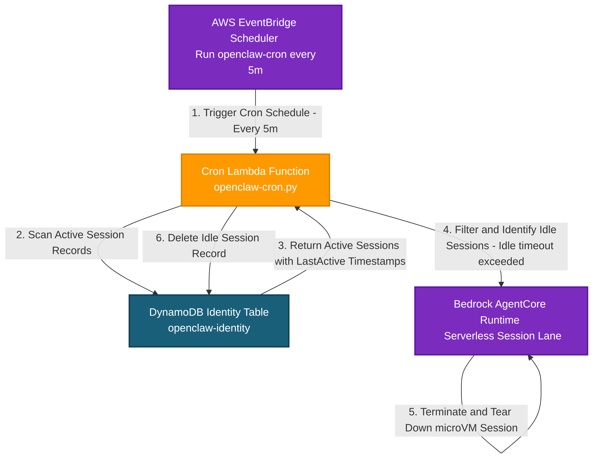
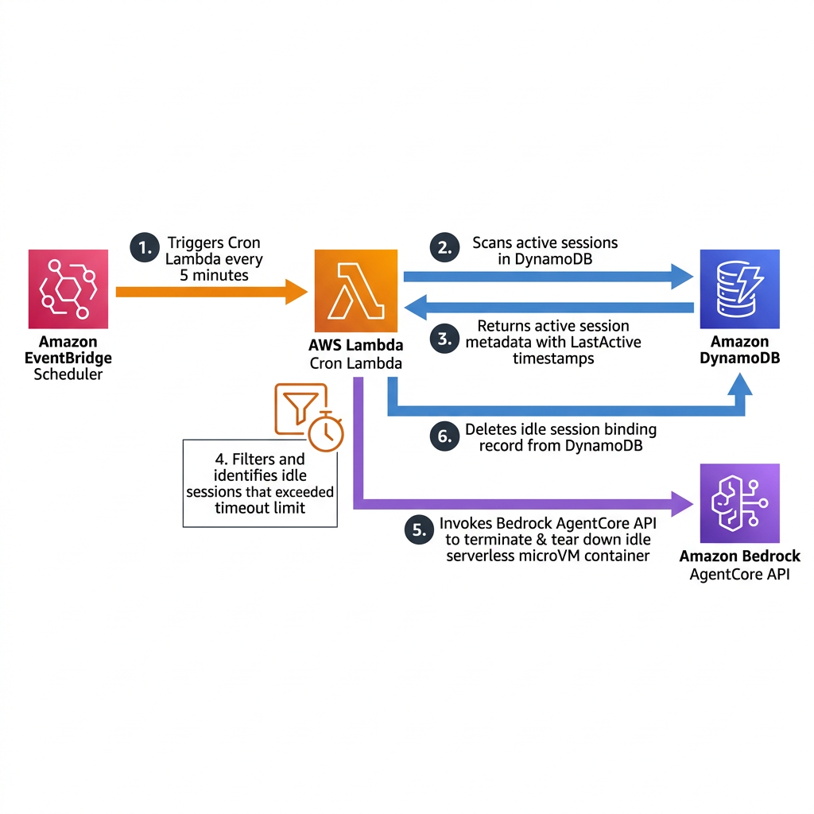

# Session Lifecycle & Cron Cleanup Design Specification

## Architectural Flow Diagrams

### Standard System Flowchart

### AWS-Style Enterprise Blueprint

This document details the architectural specifications of **`CronStack`** and the session lifecycle management model. This stack ensures secure automatic garbage collection of idle container sessions, achieving excellent resource cleanup and zero compute idling costs.

---

## 1. Per-User microVM Lifecycles

In standard multi-user LLM or agent hosting architectures, running active virtual environments or headless browser systems for users can be incredibly expensive if servers are kept constantly "online".

OpenClaw on Bedrock AgentCore eliminates this waste by relying on a serverless microVM execution model:
- **On-Demand Spin-Up**: When a user sends a message, if no active session is found in DynamoDB, the Router Lambda invokes the Bedrock AgentCore `StartAgentSession` API. This instantly provisions a dedicated, containerized sandboxed runtime microVM inside the VPC.
- **Natural Idling**: Once the message is processed and a response is dispatched, the session is left to idle. No keep-alive pings or persistent servers are maintained.
- **Automated Termination**: If a session remains idle without any new message payloads for more than 30 minutes, it is marked as expired and physically terminated.

---

## 2. EventBridge & Cron Lambda Orchestration

The automated garbage collection of idle sessions is coordinated by **`CronStack`**:

1. **Deterministic EventBridge Scheduler**:
   - Deploys an Amazon EventBridge Scheduler rule configured to fire a target event on a regular cron cadence (e.g., every 5 minutes).
   
2. **Cron Lambda Invocation (`openclaw-cron.py`)**:
   - When the scheduler fires, it invokes the **Cron Lambda function**.
   - The Cron Lambda scans the DynamoDB Identity Table (`openclaw-identity`) looking for active session metadata records (items with `SESSION#` partitions).
   - It retrieves each active session's `LastActive` ISO timestamp and compares it with the current system time.

3. **Tear-Down & Cleanup API**:
   - If `CurrentTime - LastActiveTime > IdleTimeout` (30 minutes), the session is marked for termination.
   - The Cron Lambda invokes Bedrock AgentCore's `TerminateAgentSession(sessionId)` API.
   - Bedrock AgentCore instantly tears down the physical serverless microVM inside the private VPC subnet, releasing all compute resources and deleting temporary volumes.
   - The Cron Lambda deletes the session reference and `BIND#` mapping from the DynamoDB table, restoring the user's status to an inactive, clean state.
